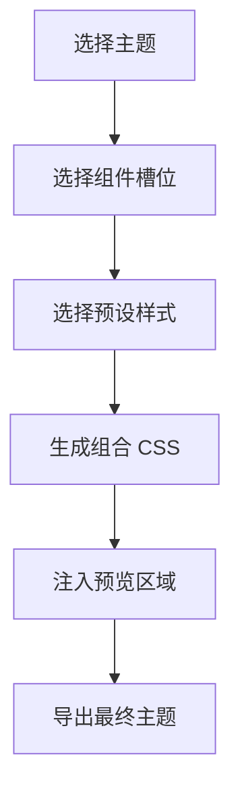
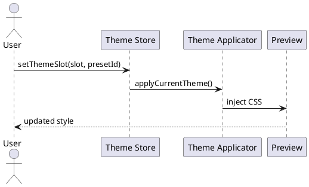

# 组合式主题系统测试文档

这是一篇用于测试 Markdown 渲染与主题组合效果的综合示例。它覆盖标题层级、正文排版、强调文本、引用、列表、表格、代码块、图片、公式、提示块、Mermaid、PlantUML、脚注和自定义标记语法。

正文中包含 **加粗文本**、_斜体文本_、`inline code`、[普通链接](https://github.com/doocs/md)，以及扩展标记：==高亮文本==、++下划线文本++、~波浪线文本~。

---

## 1. 标题层级测试

### 1.1 三级标题

#### 1.1.1 四级标题

##### 1.1.1.1 五级标题

###### 1.1.1.1.1 六级标题

标题自动编号、不同级别标题样式、标题间距、标题中的行内元素都应该正常显示，例如：**重要标题** 与 `code`。

---

## 2. 段落与排版

这是一段普通正文，用于测试主题中的正文颜色、字号、字体、行高、字距和段落间距。较长文本可以帮助观察移动端宽度、公众号预览宽度和桌面宽度下的阅读体验是否稳定。

中文、English words、数字 123456、标点符号，以及 `APIResponse<T>` 这样的技术文本应该混排自然。主题切换后，正文不应出现过密、过浅、过度装饰或难以阅读的问题。

> 这是一段普通引用。它应该与 Alert/Callout 有明显区别，同时保持良好的可读性。

---

## 3. 列表测试

### 无序列表

- 产品定位
- 主题系统
- 样式预设
- 用户组合
  - 标题样式
  - 内容组件样式
  - 高级 CSS 覆盖

### 有序列表

1. 选择一个内置主题
2. 修改单个组件样式
3. 观察预览区域变化
4. 导出最终 CSS

### 任务列表

- [x] 支持主题切换
- [x] 支持标题样式组合
- [x] 支持代码块主题
- [ ] 支持用户命名保存组合主题

---

## 4. 表格测试

| 模块     | 作用       | 是否可组合 | 推荐检查点             |
| -------- | ---------- | ---------- | ---------------------- |
| 一级标题 | 文章主视觉 | 是         | 居中、左轨、卡片、论文 |
| 二级标题 | 章节分隔   | 是         | 色块、短线、面板       |
| 引用块   | 说明与引语 | 是         | 边框、背景、间距       |
| 代码块   | 技术内容   | 是         | 边框、圆角、行高       |
| Mermaid  | 图表渲染   | 否         | 不被主题破坏           |

---

## 5. 代码块测试

### TypeScript

```ts
interface ThemeComposition {
  version: number
  slots: Record<string, string>
}

function setThemeSlot(slot: string, presetId: string) {
  return {
    slot,
    presetId,
    updatedAt: new Date().toISOString(),
  }
}
```

### CSS

```css
h2 {
  padding: 0.5em 0.8em;
  border-left: 4px solid var(--md-primary-color);
  background: #f8fafc;
}

.markup-highlight {
  background: #fde68a;
}
```

### Shell

```bash
corepack pnpm --filter @md/web type-check
corepack pnpm --filter @md/web build
```

---

## 6. Alert / Callout 测试

> [!NOTE]
> 这是一条 Note，用于测试普通信息提示块。

> [!TIP]
> 这是一条 Tip，用于测试建议类提示块。

> [!IMPORTANT]
> 这是一条 Important，用于测试重要信息的颜色和图标。

> [!WARNING]
> 这是一条 Warning，用于测试风险提示。

> [!CAUTION]
> 这是一条 Caution，用于测试强警告样式。

::: abstract
这是一个 abstract 容器式 Callout，用于测试扩展块语法。
:::

::: todo
这是一个 todo 容器式 Callout。
:::

::: danger
这是一个 danger 容器式 Callout。
:::

---

## 7. 图片与图注


图片需要测试宽度、自适应、圆角、边框、阴影、图注颜色和上下间距。

---

## 8. 公式测试

行内公式示例：$E = mc^2$，以及 $a^2 + b^2 = c^2$。

块级公式：

$$
\int_{-\infty}^{+\infty} e^{-x^2} dx = \sqrt{\pi}
$$

$$
\mathrm{softmax}(x_i) = \frac{e^{x_i}}{\sum_{j=1}^{n} e^{x_j}}
$$

---

## 9. Mermaid 图表



---

## 10. PlantUML 图表



---

## 11. 横向图片滑动

<,,>

---

## 12. 脚注与引用链接

这里有一个脚注示例。[^theme]

另一个脚注用于测试多条脚注的显示。[^css]

[^theme]: 主题系统由多个可组合的组件样式组成。
[^css]: 自定义 CSS 作为高级模式保留，并拥有最终覆盖权。

---

## 13. 复杂混排段落

在真实文章中，开发者可能会写出这样的句子：当 `themeComposition.slots.h2` 从 `h2-solid-center` 切换为 `h2-underline` 后，预览区中的二级标题应该立即从色块样式变成短下划线样式。这个过程不应该影响 Mermaid、PlantUML 或 Slider 这类特殊组件。

**结论：** 如果这篇文档在不同主题下都保持清晰、稳定、无明显错位，说明主题系统的基础效果是可靠的。
